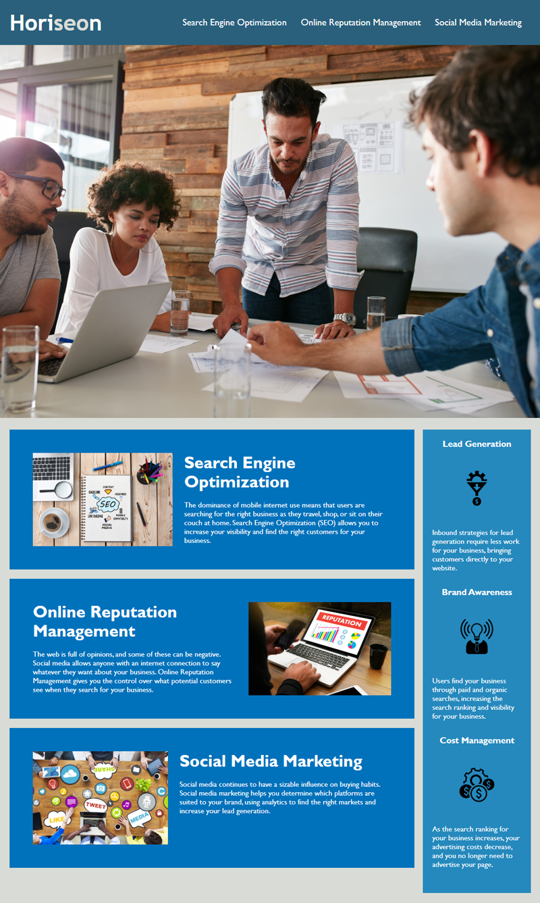

# horiseon-reinvention-primero
# Horiseon Makeover
## Description 

The repository: 

The Horiseon Makeover project is a refactoring endeavor focused on transforming a webpage to enhance its accessibility. The primary goal is to ensure the HTML and CSS codebase is semantically correct, logically structured, and in a sequence that promotes data sharing and sustainability across various platforms.

Key considerations in this makeover include identifying and eliminating code repetitions, optimizing the use of HTML elements, and ensuring that image elements incorporate meaningful alt attributes. The overarching motivation is to improve accessibility, enabling people with disabilities to navigate the web pages seamlessly while also enhancing the website's search engine standing. Ensuring all links function correctly is another essential aspect to guarantee the webpage's long-term utility.

This project is driven by the intention to elevate the accessibility of the provided webpage through thoughtful code enhancements.

 

Link to the deployed application: https://zhaolucas.github.io/horiseon-reinvention-primero/

## Table of Contents

* [Installation](#installation)
* [Usage](#usage)
* [Credits](#credits)
* [License](#license)

## Installation

To set up the development environment, load the HTML and CSS files into a VS Code editor along with the README. Use Git commands in the terminal to commit changes to GitHub.

## Usage 

## Credits

TA 
Instructor 
W3 Schools

## License

NIL 

## Badges

NA 

## Features

The webpage allows for SEO maximization. 

## Contributing

Please contribute direclty as you wish. 

## Tests

All links, images and alt texts open. 

© 2023 edX Boot Camps LLC. Confidential and Proprietary. All Rights Reserved.
